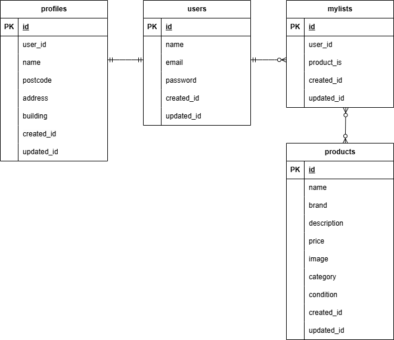

# coachtechフリマアプリ

## 環境構築

### Docker ビルド
1. git clone git@github.com:sugihara0105/case1.git
2. docker-compose up -d --build

### Laravel環境構築
1. docker-compose exec php bash
2. composer install
3. cp .env.example .env
4. .envファイルの一部を以下のように編集

```
DB_HOST=mysql
DB_DATABASE=laravel_db
DB_USERNAME=laravel_user
DB_PASSWORD=laravel_pass
```

5. php artisan key:generate
6. php artisan migrate
7. php artisan db:seed

## 使用技術
- MySQL 8.0.26
- PHP 8.4.12
- Laravel 8.83.8

## URL
- 環境開発: http://localhost/
- phpMyAdmin: http://localhost:8080/

## ER図
